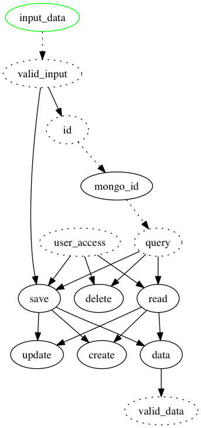

## Example CRUD with clues

clues-crud is a very flexibile implemention of CRUD on top of mongoose. In the default setting you just need to provide a $model and define a function for where user_input comes from (if any) and how the _id of each query is defined.

Example:
``` 
crud({
  $model : exampleModel,
  user_access : {},
  input_data : ['input.exampleInput',function(d) { return d;}],
  id : ['input.id',function(d) { return d;}]
})
``` 

The following CRUD commands are available:

* `create` - creates a record if one doesn't exist already
* `read` - returns saved data (it exists)
* `update` - update a record (if exists)
* `delete` - deletes a record

A more advanced endpoint is `valid_data`.  This endpoint allows for a final transform/validation and returns either the input data that was just saved (if valid input data was provided and saved successfully) or the most recently saved data (in any other case).  

There are two points of validation, the first one on the way in `valid_input` and the second one on the way out `valid_data`.  Usually you only need to define one of them, depending on whether you want partial/unvalidated data saved or not.   If `valid_input` is a simple passthrough and `valid_data` performs the validation, any changes/updates are saved but further use of the data will be trapped by the `valid_data` validator.   If 'valid_input' performs comprehensive validations, updates will not be saved unless they pass validation.


## Crud dependency graph


## API Reference
#### `$model` (required)
A placeholder for the mongoose data model

#### `user_access` (required)
Should return an object that constrains any queries to objects that should be accessable to this user.  For more fine-grained control you can define `read_access` and `write_access` (both by default mirror the `user_access` object).   For unlimited access simply set `user_access` to an empty object `{}`.

#### `input_data` (required)
Custom function required to provide the set of inputs for any update/create.
Example:
```
input_data : ['input.data_entry',function(d) { return d;}]
``` 

#### `valid_input` (optional)
This function checks the `input_data` for potential errors before passing the data to update/create.   By default, this function goes through the mongoose validators and throws an error with object `xflash` containing the field-level messages. It also enforces the defined mongoose models (fields that are not in the model aren't propagated).  

#### `id` (optional)
The string representation of the mongo id.  By default this value is fetched from either the submitted input object or `input.id`. Should be overwritten to provide a more precice mapping.

#### `mongo_id` (internal)
Function that converts the string `id` into a proper `ObjectId` if necessary.

#### `query` (optional)
The default query is simply a search for an _id that matches the supplied mongo_id.   In some cases you need to overwrite the query function to use a different a different unique identifier than _id (for example when multiple users might have overlapping unique identifiers for any records). 

#### `create`
This function creates a record from `valid_input` if the record doesn't already exist and input was successfully validated.

#### `read`
Reads a single record and returns the result.

#### `update`
Updates a record found with 'query' using 'valid_input'.  If the record does not exists, validation failed or the user has no access, an error is thrown.

#### `delete`
Deletes a record specified with 'query'

#### `save`
Saves the record, either by updating a previously existing record or by creating a new one (if a corresponding record does not exists)

#### `data`
Returns either the updated/created data (if valid_input was provided and save successful) or the previously saved data (if a record exists).   

#### `valid_data` (optional)
This is a placeholder for any validation of the data coming out.  
